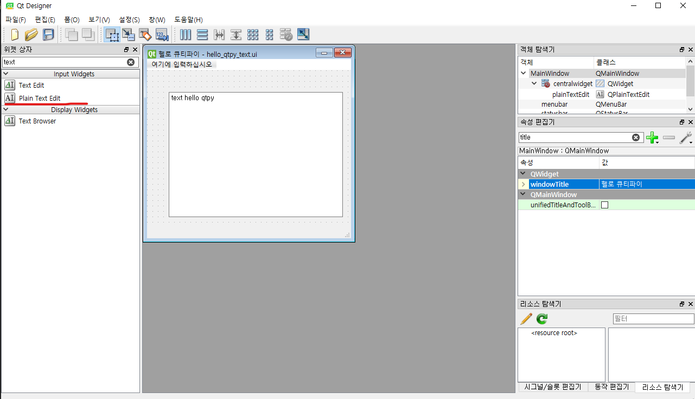
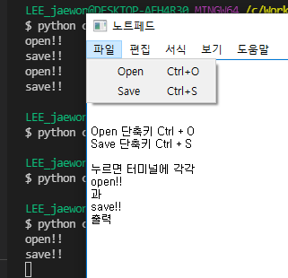

# PyQt

#### what is pyqt?

> Qt의 레이아웃에 Python의 코드를 연결하여
>
>  GUI 프로그램을 만들 수 있게 해주는 프레임워크를 의미

## 접속방법

아나콘다 터미널에서 

`designer` 입력

## Basic

기본은 designer입력으로 나온 레이아웃에서 대부분 해결가능

### 파일 설명

- hello_qtpy : qtpy의 기본 코드를 다룸
- 02 : 프레임워크를 살짝이용
- 03 : 메뉴바 만들고 단축키 지정 기존 클래스 이용해 잘 작동하는지를 터미널에 출력함

